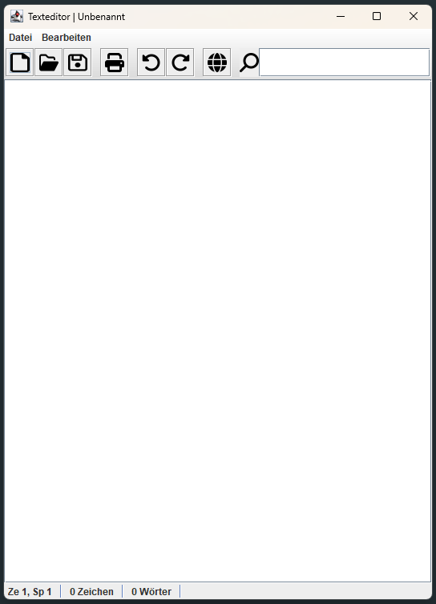
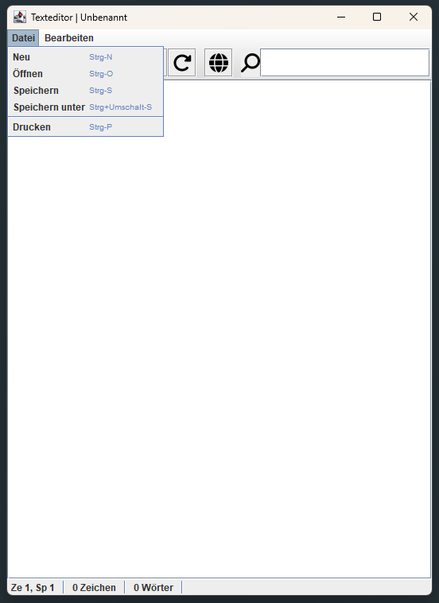
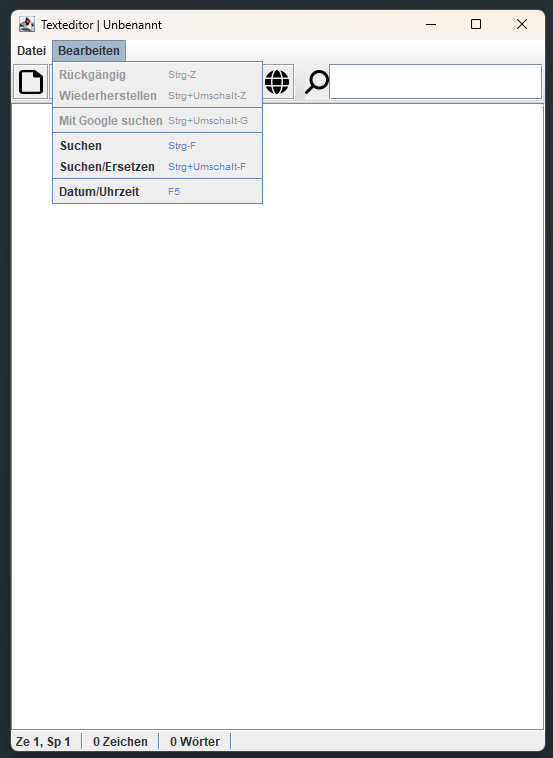
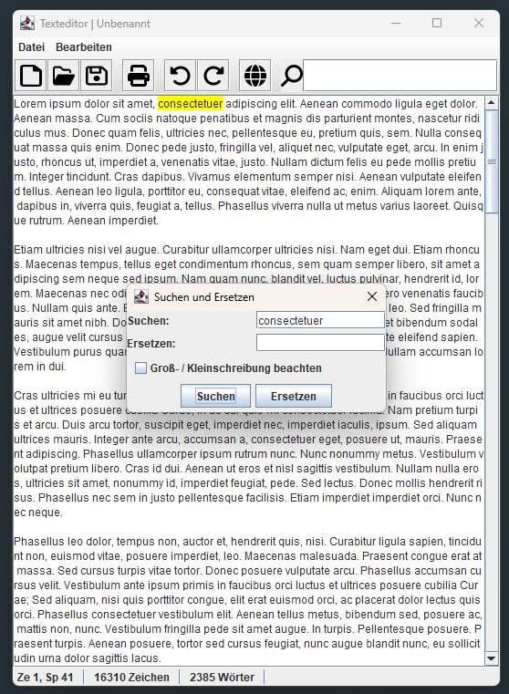
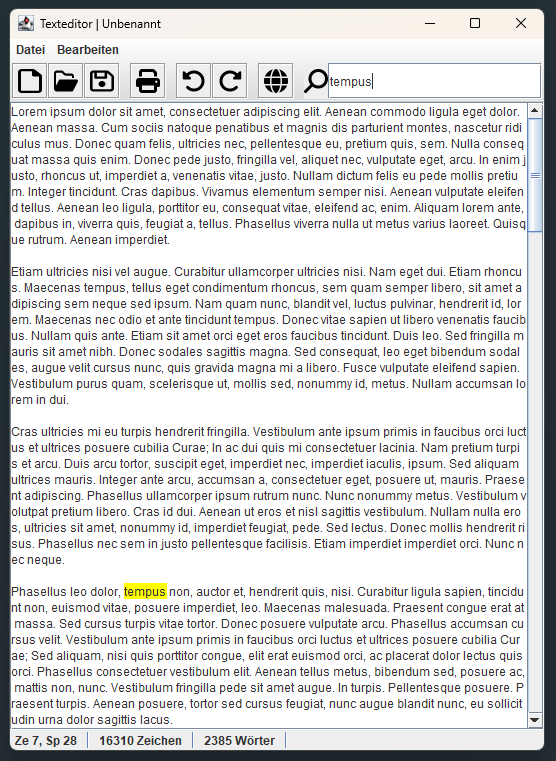
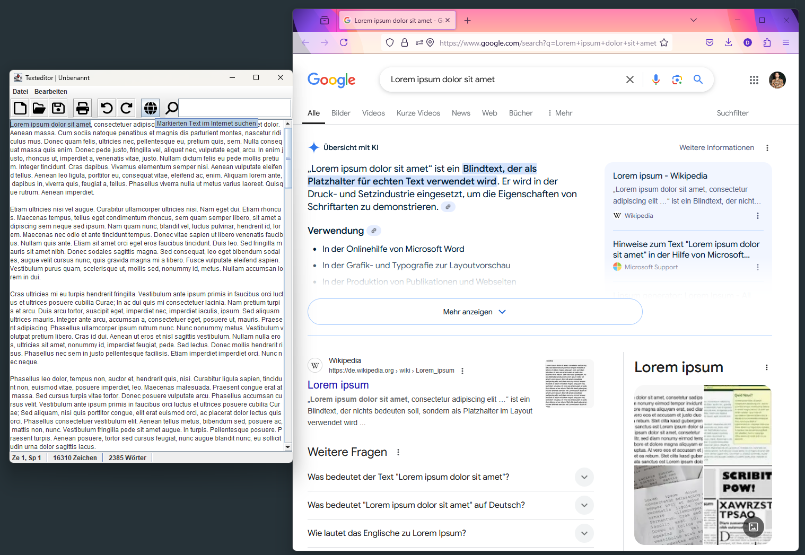

# TextEditor

>A very simple Java Swing text editor oriented on the example of the MS Editor.
>  It supports editing, file operations, undo/redo, search and replace, and even a Google web search
>    This was my first real GUI application as part of a uni project.
> >**Note:** The application's user interface is currently only available in **German**.

## Preview of the application:
*_The main window with all its components_*

  

### Menu Bar
#### File Menu

  
Consisting of the following menu items:
- New File
- Open File
- Save File
- Save File As
- Print File

 

#### Edit Menu

  
Consisting of the following menu items:
- Undo
- Redo
- Web Search -> search with Google
- Search -> not case-sensitive
- Search and Replace
- Date / Time -> inserts the current date (DD.MM.YYYY) and time (HH:MM, 24h) into the text area

*_Search And Replace Dialog:_*

  

#### Toolbar
Consisting of buttons and a text field for following components:
- New File
- Open File
- Save File
- Print File
- Undo
- Redo
- Web Search
- Search -> not case-sensitive

*_Search function:_*

*_Web Search function:_*

  

#### Text Area
- The text area consists of only a simple JTextArea with automatic text wrapping.

  
#### Status Bar
Provides the following information:
- The current line and column coordinates of the cursor
- The total of characters written
- The total of words written

## Brief description
TextEditor is a Java Swing-based desktop application that enables users to create, open, edit, and save plain text documents. 
The editor offers a graphical interface with a menu bar, toolbar, and editable text area using JTextArea. 
The objective was to provide a clear, functional, and user-friendly text editing tool with essential features 
comparable to simple desktop editors.
 The basic requirements were to support text editing and file operations (new, open, save), each of which is implemented 
with dialog-based interactions using JFileChooser. 
 Filters have been implemented for the file selection menus that offer the options of displaying either .txt or all files.

The core requirements were extended by several functions, such as the function to print the document, 
an 'undo / redo' function, an integrated web search (Google) and the option to write the current date and time by using the F5 key.
 All relevant functions can be accessed by their representation within the toolbar or by pressing the 
corresponding keyboard shortcuts. This ensures that the programme is practical to use and provides 
the usual comfort functions of a text programme.

Furthermore, a status bar has been implemented to help the user to orientate themselves within the document and to provide 
information about the total amount of characters and words written.

The separation of responsibilities - visual and logical components - and the implemented functions meet the core 
requirements of the application and provide a basis for future enhancements.